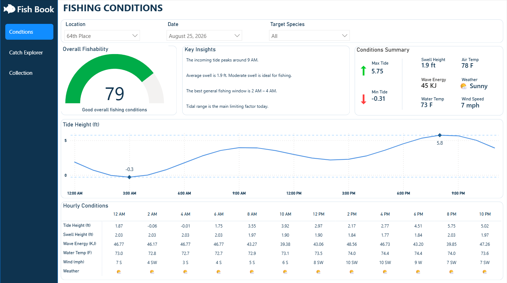
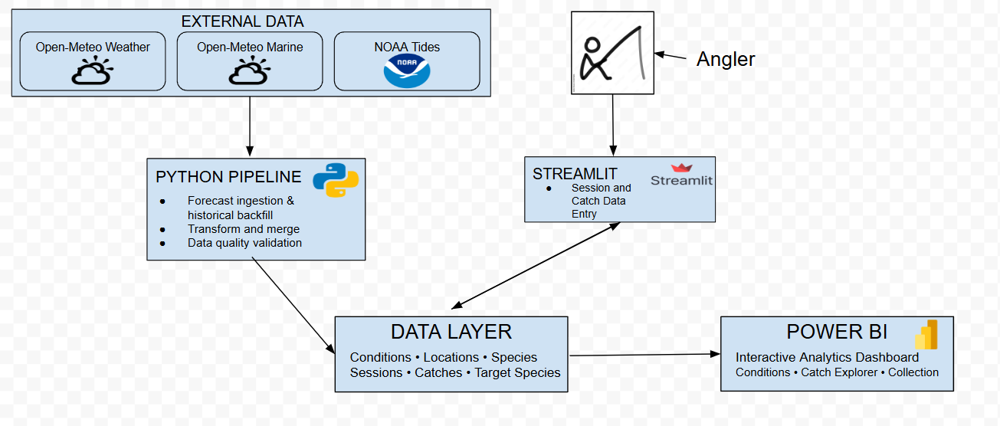
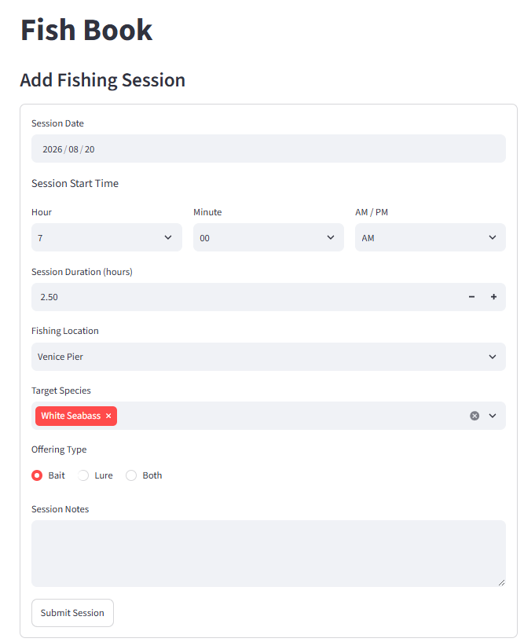
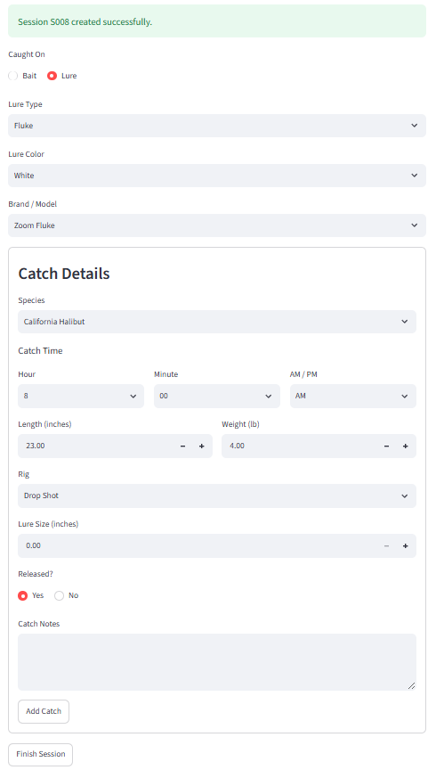
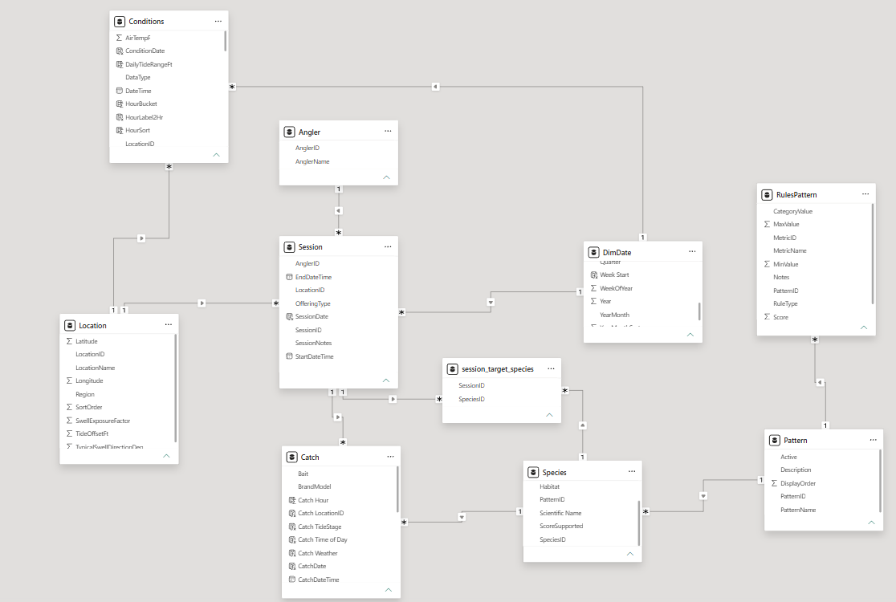
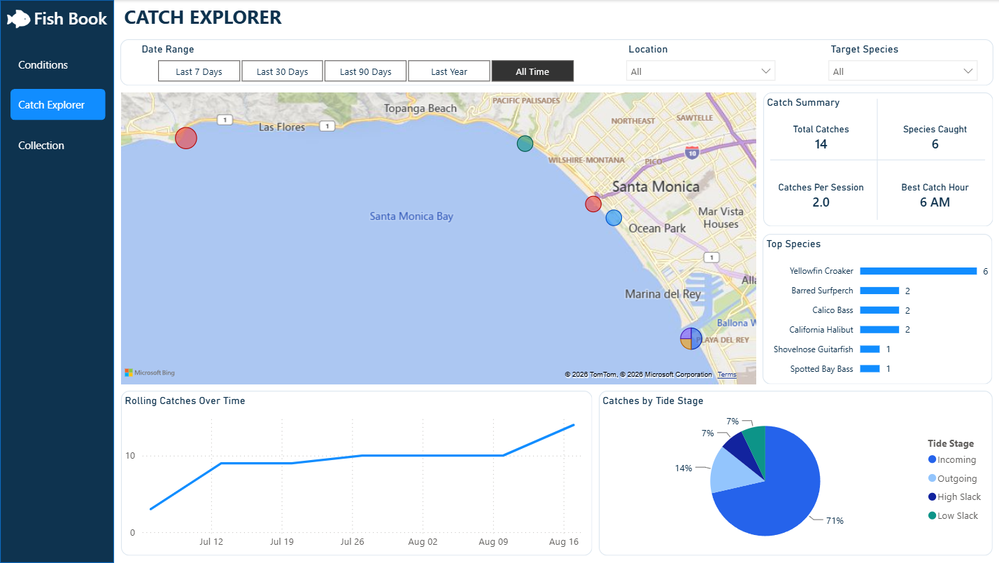
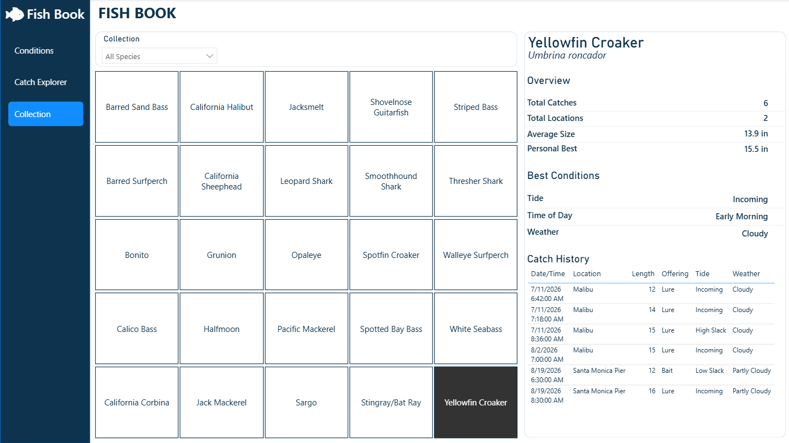

# 🎣 Fish Book

### An end-to-end analytics platform for California shore fishing

Fish Book is a personal analytics project designed to bring together the information I use when planning fishing trips and help identify the conditions associated with successful catches.

The project combines hourly weather, marine, and tide data with user-recorded fishing sessions and catches. A Python pipeline handles environmental data collection and processing, a Streamlit application provides structured session and catch entry, and Power BI brings the data together for interactive analysis.

**Tech Stack:** Python · pandas · REST APIs · Streamlit · Power BI · DAX · Power Query



**Dashboard Pages:** Fishing Conditions · Catch Explorer · Collection

---

## Project Overview

Planning a shore fishing trip often requires checking several different sources for tides, swell, weather, wind, and other conditions. Even with that information available, it can be difficult to learn from previous fishing sessions because catch history and environmental conditions are rarely stored together.

I built Fish Book to create a single data ecosystem that could:

- Consolidate weather, marine, and tide conditions for LA County surf fishing locations
- Maintain both historical conditions and upcoming forecasts
- Capture fishing sessions and catches through structured data entry
- Connect catch history with environmental conditions
- Analyze fishing performance by species, location, time, tide stage, and other factors
- Provide an extensible foundation for future species-specific fishing recommendations

---

## Architecture

Fish Book combines externally sourced environmental data with user-generated fishing data.



Environmental conditions are retrieved and processed through a Python pipeline, while fishing sessions and catches are entered through a Streamlit application. These datasets form the data layer used by the Power BI reporting application.

### Data Sources

Environmental data is sourced from:

- **Open-Meteo Weather API** — temperature, precipitation, wind, and weather conditions
- **Open-Meteo Marine API** — swell height, swell period, and water temperature
- **NOAA Tides & Currents API** — hourly tide predictions

The current implementation covers **57 Los Angeles County coastal fishing locations**.

---

## Data Discovery & Planning

Before development, I created a data discovery workbook to define the information needed for the application, identify potential sources, and determine how each field would be used.

The discovery process helped establish a blueprint of the required environmental, location, species, session, and catch data before development began.

➡️ [View the Data Discovery Workbook](docs/fishbook_data_discovery.csv)

---

## Design & Wireframing

Before building the Power BI report, I created page-level wireframes to establish the information hierarchy and intended functionality. After defining the layouts and requirements, I used AI to turn the wireframes into visual mockups that helped guide the final dashboard design.

The initial design focused on three primary experiences:

1. **Conditions** — evaluate historical, current, and forecasted fishing conditions
2. **Catch Explorer** — analyze historical catches and fishing performance
3. **Collection** — catalog caught species and individual catch history

➡️ [View the Wireframe Document](docs/fishbook_wireframe.pdf)

---

## Python Data Pipeline

The environmental data pipeline is built in Python using pandas and REST APIs.

The pipeline supports:

- Forecast data retrieval
- Historical data backfills
- Weather, marine, and tide data integration
- Location-specific tide adjustments
- Derived fields such as wave energy and weather descriptions
- Historical/forecast classification
- Duplicate prevention during incremental updates
- Data quality validation

The resulting conditions dataset contains hourly observations across the 57 supported fishing locations.

### Pipeline Components

- [`api.py`](src/api.py) — API retrieval, transformation, and location-level condition processing
- [`build_all_conditions.py`](src/build_all_conditions.py) — retrieves current/forecast conditions across all locations and merges them with stored history
- [`backfill_conditions.py`](src/backfill_conditions.py) — retrieves historical environmental data
- [`validate_conditions.py`](src/validate_conditions.py) — validates location coverage, duplicates, data types, and null percentages

A representative subset of the generated conditions dataset is available here:

➡️ [View Sample Conditions Data](data/sample/conditions_sample.csv)

---

## Streamlit Data Entry Application

A Streamlit application provides structured entry for fishing sessions and individual catches.

Rather than relying on unrestricted manual entry, selectable fields use controlled vocabularies where appropriate to improve consistency and prevent small naming differences from creating downstream data-quality issues.

### Session Entry

The session form captures information including:

- Date and start time
- Session duration
- Fishing location
- One or more target species
- Offering type
- Session notes



### Catch Entry

After a session is created, the user is taken directly into the catch-entry workflow. Catch records are automatically associated with the active fishing session.

The form supports conditional bait/lure fields and captures information such as species, catch time, size, rig, offering details, release status, and notes.



➡️ [View Streamlit Source Code](app/app.py)

---

## Power BI Data Model

The reporting layer uses a relational model connecting environmental conditions, fishing locations, sessions, catches, target species, and species reference data.



---

## Power BI Dashboard

### Fishing Conditions

The Conditions page provides a daily view of the factors relevant to planning a fishing session.

Features include:

- Location, date, and target-species selection
- Overall and species-specific fishability scoring
- Key condition insights
- Daily condition summary
- Hourly tide curve
- Hourly swell, wave energy, water temperature, wind, and weather


---

### Catch Explorer

Catch Explorer connects recorded catches with location, time, species, and environmental context.

Features include:

- Interactive catch map
- Date range, location, and target-species filtering
- Total catches and species caught
- Catches per fishing session
- Best catch hour
- Top caught species
- Rolling weekly catch history
- Catch distribution by tide stage



---

### Collection

The Collection page provides a species-level view of fishing history.

Users can select a species to review its catch history, locations, average size, personal best, and the conditions most commonly associated with successful catches.



➡️ [Download the Power BI Report](powerbi/FishBook.pbix)

---

## Key Technical Decisions

### Controlled Data Entry

Fishing data can easily become inconsistent when fields such as species, lure type, color, or rig are entered manually. The Streamlit application therefore uses predefined selections where practical while retaining custom-entry options for cases that require additional specificity.

### Separating Target Species from Caught Species

Target species are modeled separately from actual catches. A session can target multiple species through a bridge table, while each catch records the species actually caught.

This preserves the distinction between fishing strategy and fishing outcome and creates opportunities for future analysis of target-species success rates.

### Historical and Forecast Conditions

Environmental data is classified as historical or forecast based on its timestamp. New API pulls are merged with previously stored data and duplicate location/timestamp combinations are removed, allowing forecast observations to transition into historical records as the dataset grows.

### Tide Modeling

NOAA tide predictions use a reference tide station with location-specific tide-height adjustments. This provides consistent tide information across the supported locations while acknowledging that local conditions may differ from official station predictions.

---

## Future Development

Fish Book is designed as an extensible analytics project rather than a finished commercial application.

Potential future development includes:

-Expanding the session and catch dataset through continued use
-Analyzing catch success relative to targeted species
-Developing species-specific fishability scoring using accumulated catch history
-Improving location-specific tide predictions and modeling
-Migrating the CSV-based data layer to a relational or cloud database
-Automating scheduled environmental data ingestion and refreshes
-Deploying the Streamlit application for remote session and catch entry
-Supporting multiple user profiles and social connections between anglers
-Expanding geographic coverage beyond Los Angeles County

---

## Repository Structure

```text
fish-book/
├── app/               # Streamlit application
├── data/              # Reference and sample datasets
├── docs/              # Discovery, wireframes, diagrams, and screenshots
├── powerbi/           # Power BI report
├── src/               # Python data pipeline
├── tests/             # Development and API testing
├── .gitignore
├── requirements.txt
└── README.md
```

---

## Tools & Technologies

**Python** · **pandas** · **REST APIs** · **Streamlit** · **Power BI** · **DAX** · **Power Query**
